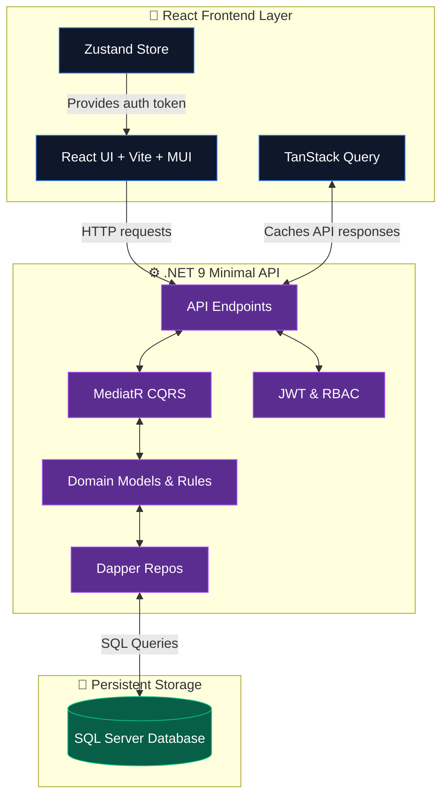
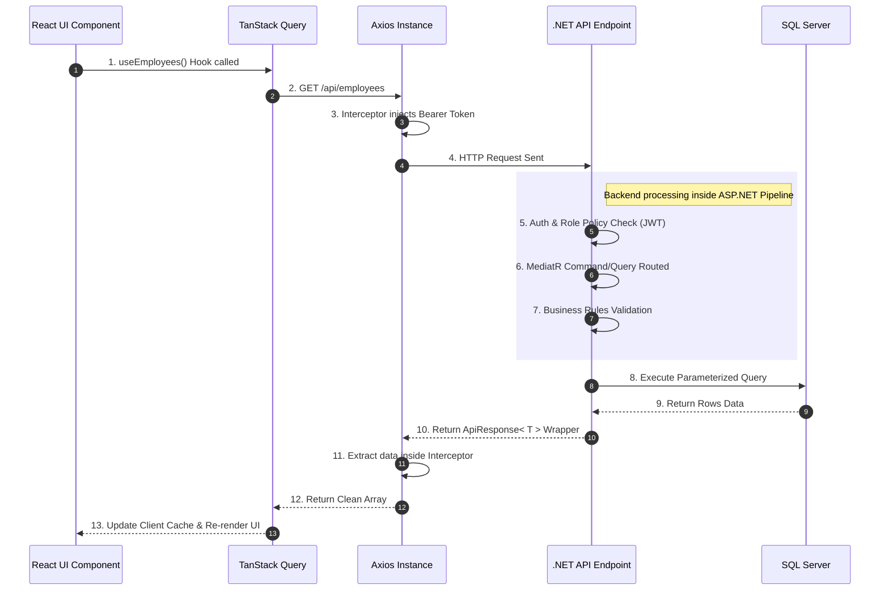
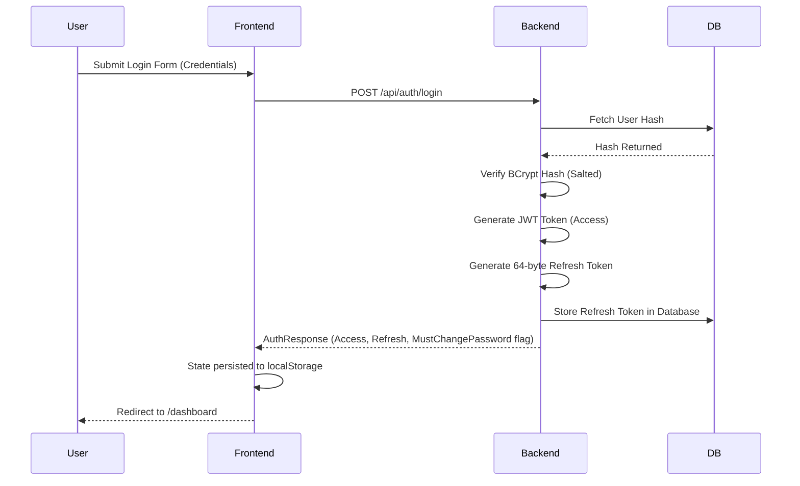

# 📘 HR MANAGEMENT SYSTEM — FULL DOCUMENTATION

> **Version:** 1.0  
> **Date:** March 24, 2026  
> **Project:** EMS_IKEN_Intern (Employee Management System)

---

## 🏗️ 1. PROJECT OVERVIEW & ARCHITECTURE

The **HR Management System** is a full-stack web application designed to manage employees, departments, and positions within an organization. It provides secure authentication, role-based authorization, and full CRUD operations for organizational data.

### System Architecture Diagram

### Technologies Used

| Layer | Technologies |
|---|---|
| **Frontend** | React 18, Vite, TypeScript, MUI v5, Axios, TanStack Query, Zustand, React Hook Form, Zod |
| **Backend** | .NET 9.0 Minimal API, MediatR (CQRS), Dapper, BCrypt, JWT Bearer Auth |
| **Database** | SQL Server (via `Microsoft.Data.SqlClient`) |

---

## 🔄 2. SYSTEM DATA FLOW

### Comprehensive Request Lifecycle

---

## 🔐 3. AUTHENTICATION & SECURITY FLOW

The system implemented a highly secure **dual-token architecture**: a strict short-lived JWT Access Token paired with a durable Refresh Token.

### Login Flow & Token Rotation

### Role-Based Access Control (RBAC) Enforcement

The RBAC implementation prevents unauthorized resource utilization globally. 

| Role | Frontend Sidebar Elements | Employee Actions Accessible | Dept/Pos Endpoint Permissions |
|---|---|---|---|
| **Admin** | Profile, Employees, Departments, Positions | Full System Automation | Full CRUD |
| **HR** | Profile, Employees | Create, Edit, Delete | ❌ Hidden & Denied |
| **Manager** | Profile, Employees | Read only view | ❌ Hidden & Denied |
| **Employee** | Profile only | ❌ View only self | ❌ Hidden & Denied |

---

## 🚨 4. ERROR FIXES & CRITICAL RESOLUTIONS

An exhaustive system-wide audit captured and resolved 13 outstanding systemic issues required for production readiness:

### 🔴 Critical Failures Prevented
1. **Frontend Authentication Misalignment:** 
   - *Issue*: `Login.tsx` tried to extract `data.token.accessToken` when the backend payload utilized the flattened schema inside an `ApiResponse` wrapper.
   - *Fix*: Decoupled the token mapping. The shape was fixed across all frontend interceptors.
2. **Global Response Mismatch Data-Fetching:** 
   - *Issue*: `ApiResponse` interface checked for `isSuccess` while backend used `success`. Fetch logic crashed iterating mapped items.
   - *Fix*: Standardized interface schema, forcing API clients to unwrap nested `data.data` responses globally ensuring TanStack query parsed lists correctly.

### 🟡 Mid-Level Issues Resolved
3. **Ghost Expirations:** Interceptor correctly intercepts 401s; however, invalid logouts returned a 403 Forbidden payload rather than a 401 Unauthorized via `GlobalExceptionMiddleware`. Reverted error responses back to 401 standard.
4. **Zombie Records (Soft-Delete Logic):** Repositories missed injecting `IsDeleted=0` condition during basic `GetById` and `Exists` checks, enabling duplicate entries. Added constraint validations globally inside Dapper operations.
5. **Token Churn Overload:** Adjusted `Jwt:DurationInMinutes` from 1 minute (developer default) to 60 minutes for production to optimize bandwidth.

---

## 🔒 5. SECURE ONBOARDING & PROFILE MAPPING ARCHITECTURE

A robust 1-to-1 User/Employee mapping lifecycle has been introduced:

### Onboarding Flow
1. **Creation:** HR uses `/api/employees` to create an Employee. The backend *automatically* creates a `User` account behind the scenes with a temporary password and flags `MustChangePassword = true`.
2. **First Login:** The user logs in. The `LoginHandler` returns `mustChangePassword: true` natively triggering the frontend intercept.
3. **Change Password:** The user triggers `PUT /api/auth/change-password` resetting their internal BCrypt hash and clearing the flag.
4. **Profile Access:** The system intrinsically routes authorization to `GET /api/employees/by-user/{userId}` bypassing role limitations to surface the owner's contextual data perfectly.

---

## 📂 6. BACKEND INFRASTRUCTURE PATTERNS

The application leverages C# Clean Architecture best paradigms with Minimal APIs.

### Infrastructure Layers
- **Core Domain:** `BaseEntity.cs` contains auto-populated `CreatedAt` and `IsDeleted` flags.
- **Data Repositories:** Leverages abstract subclassing `Repository<T>` executing raw performant SQL Dapper queries. 
- **CQRS Integration:** `MediatR` forces handler separation into highly decoupled logic chunks.
- **Business Rule Encapsulation:** Independent `DepartmentBusinessRules` or `EmployeeBusinessRules` instances capture complex entity relationships.

---

## 🔍 7. RECOMMENDATIONS FOR ENTERPRISE SCALING

- **Response Caching Pattern:** For `GET /employees` implementing `IMemoryCache` for immutable fetches.
- **Refresh Token Cleanup Worker:** Implement a Background Service wiping out stale/expired refresh tokens hourly.
- **CI/CD Implementations:** Add Docker setup logic and xUnit integrations running continuously before main deployments.

> *End of Verified HR Application Documentation.*
